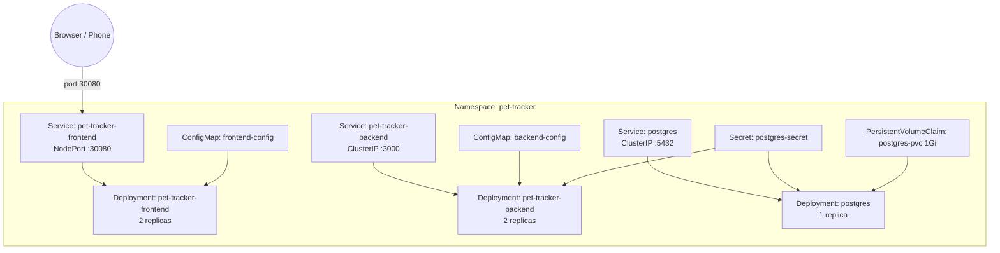
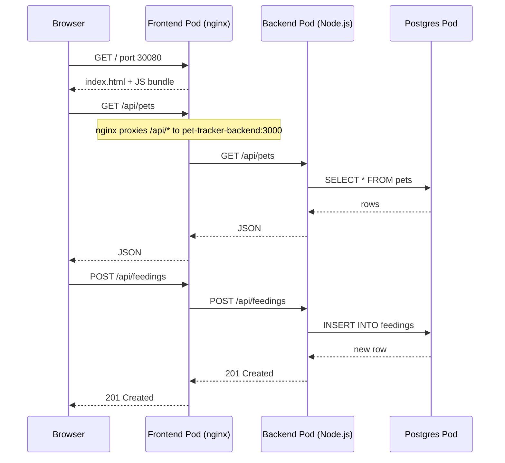
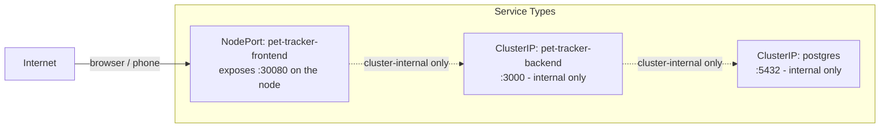
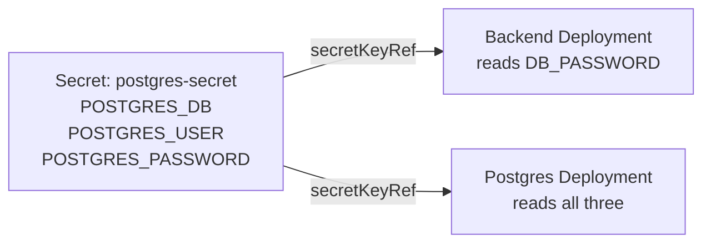
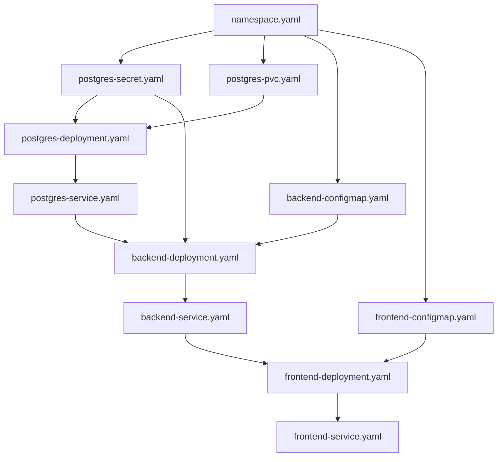

# Kubernetes Architecture

This document explains how the Kubernetes resources in `k8s/` fit together and how traffic flows through the app.

---

## Overview

All resources live in a single namespace (`pet-tracker`) and run on a local k3s cluster. There are three workloads — frontend, backend, and postgres — each with its own Deployment and Service.



---

## Request Flow

When a user opens the app or taps a button, here's the path a request takes:



The frontend pod's nginx config is what makes this work — it serves static files for all non-`/api` routes, and reverse-proxies `/api/*` to the backend service by DNS name (`pet-tracker-backend:3000`). Kubernetes DNS resolves that name to the backend ClusterIP automatically.

---

## Resource Breakdown

### Namespace

```yaml
# k8s/namespace.yaml
kind: Namespace
metadata:
  name: pet-tracker
```

All resources are scoped to the `pet-tracker` namespace. This keeps the app isolated from other workloads on the cluster and lets you tear everything down in one command (`kubectl delete namespace pet-tracker`).

---

### Services

Services give stable network addresses to Deployments. Pod IPs change when pods restart; Service IPs don't.



| Service | Type | Port | Accessible from |
|---|---|---|---|
| `pet-tracker-frontend` | NodePort | 30080 | Browser, phone on same network |
| `pet-tracker-backend` | ClusterIP | 3000 | Inside cluster only |
| `postgres` | ClusterIP | 5432 | Inside cluster only |

Only the frontend needs to be reachable from outside the cluster, so it's the only NodePort. The backend and postgres use ClusterIP, which means they can't be reached from outside the cluster at all.

---

### Deployments

Each Deployment manages a set of replica pods and handles rolling restarts.

**Frontend** (`k8s/frontend-deployment.yaml`)
- 2 replicas of the nginx container serving the React bundle
- `imagePullPolicy: Never` — tells k3s to use the locally imported image instead of pulling from a registry
- Readiness probe: `GET /` on port 80

**Backend** (`k8s/backend-deployment.yaml`)
- 2 replicas of the Node.js Express app
- `imagePullPolicy: Never` — same reason as frontend
- Reads DB connection config from `backend-config` ConfigMap and `postgres-secret` Secret
- Readiness probe: `GET /api/health` on port 3000 (initial delay 10s)
- Liveness probe: same endpoint, starts after 30s, restarted if it fails

**Postgres** (`k8s/postgres-deployment.yaml`)
- 1 replica (postgres doesn't support multi-replica without additional tooling)
- Uses the official `postgres:15` image pulled from Docker Hub
- Credentials injected from `postgres-secret`
- Mounts the PVC at `/var/lib/postgresql/data` so data survives pod restarts
- Readiness probe: `pg_isready` command

> **Why `imagePullPolicy: Never` on frontend and backend?**
> k3s uses containerd, not the Docker daemon. Docker-built images aren't automatically visible to k3s. You have to export them with `docker save` and import them with `k3s ctr images import`. Setting `imagePullPolicy: Never` tells Kubernetes not to try pulling from a registry and to use the already-imported image instead.

---

### ConfigMaps

ConfigMaps hold non-sensitive configuration that's injected into pods as environment variables.

**`backend-config`** (`k8s/backend-configmap.yaml`)
```
DB_HOST=postgres       ← Kubernetes DNS name of the postgres Service
DB_PORT=5432
DB_NAME=pettracker
DB_USER=petuser
PORT=3000
```

**`frontend-config`** (`k8s/frontend-configmap.yaml`)
```
API_BASE_URL=http://pet-tracker-backend:3000
```
This isn't currently used at runtime (nginx handles the proxy), but records where the backend lives.

---

### Secret

`postgres-secret` holds the database credentials as base64-encoded values. It's referenced by both the backend and postgres deployments.



The backend only needs `POSTGRES_PASSWORD` — the other values come from the ConfigMap. Postgres needs all three to initialize the database on first boot.

`postgres-secret.yaml` is excluded from version control via `.gitignore`. Copy `postgres-secret.yaml.example` and fill in your own base64-encoded values before deploying.

---

### PersistentVolumeClaim

```yaml
# k8s/postgres-pvc.yaml
kind: PersistentVolumeClaim
metadata:
  name: postgres-pvc
spec:
  accessModes: [ReadWriteOnce]
  resources:
    requests:
      storage: 1Gi
```

The PVC requests 1Gi of storage from the cluster. k3s automatically provisions it using its built-in local-path storage class. The postgres pod mounts this at `/var/lib/postgresql/data`, so the database survives pod restarts and redeployments.

`ReadWriteOnce` means only one node can mount it at a time — fine here since postgres only runs one replica.

---

## Deploy Order

Some resources must exist before others can start successfully. The dependency order is:



In practice, `kubectl apply -f k8s/` applies everything at once and Kubernetes retries until dependencies are ready. The readiness probes on the backend prevent it from receiving traffic until it has a working database connection.
